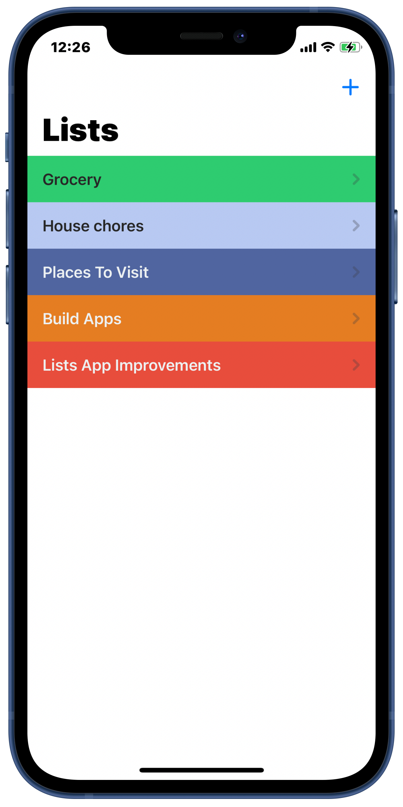
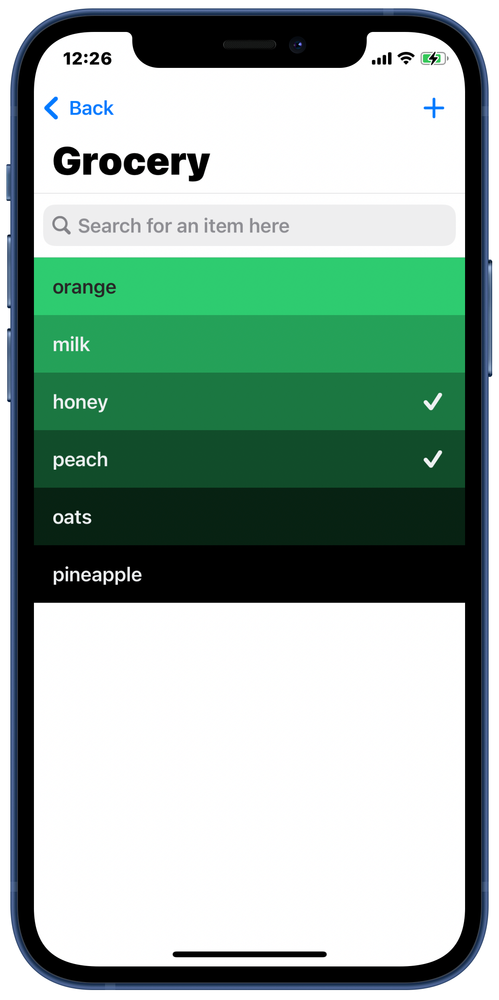
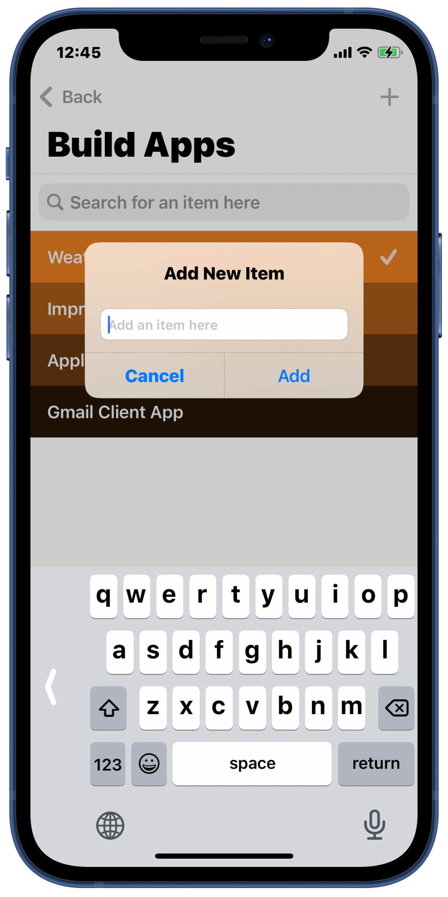
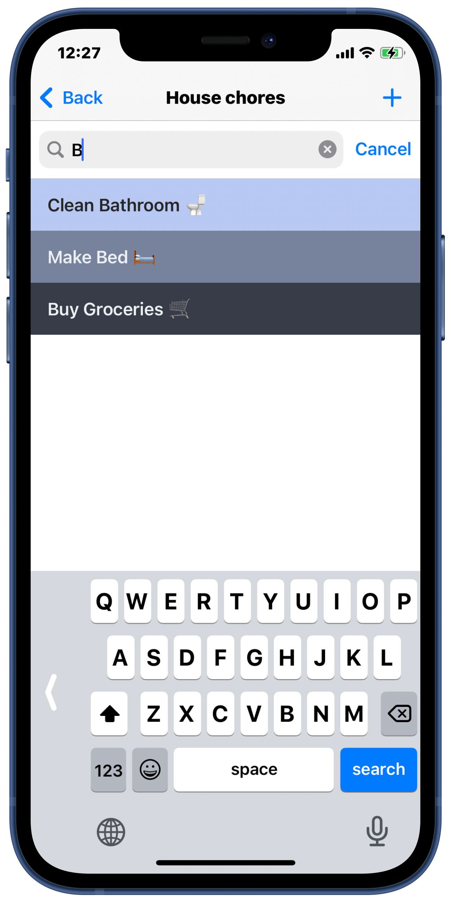
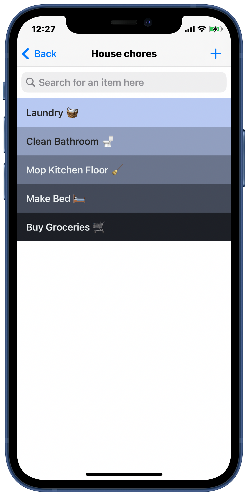
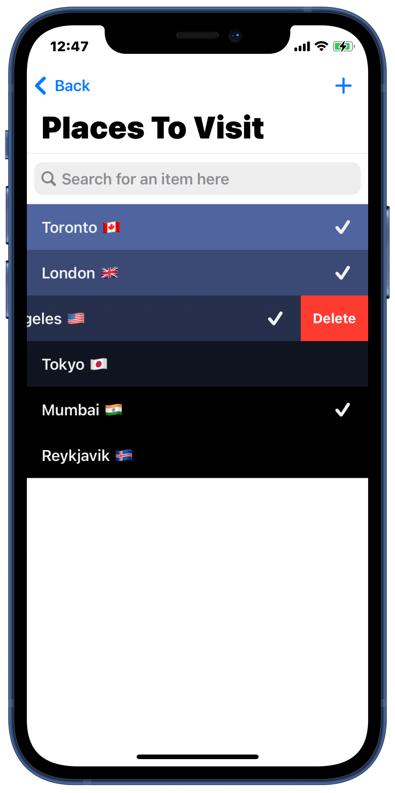

# Todoey App for iOS

An app to create to do lists and notes for any purpose presented beautifully using colored gradients. Built natively using Swift and UIKit. No Data Collected.

## App Screenshots

  
 
 

  
 
 

### Features

* Create to do lists for any purpose
* Items presented in beautiful colored gradeints
* Supports Dark Mode
* Search through items in a category
* Locally stored on device with no data collection
* Add a tickmark for items completion

### Libraries Used

1. Realm Database
2. Chameleon for coloring the UI
3. SwipeCellKit
